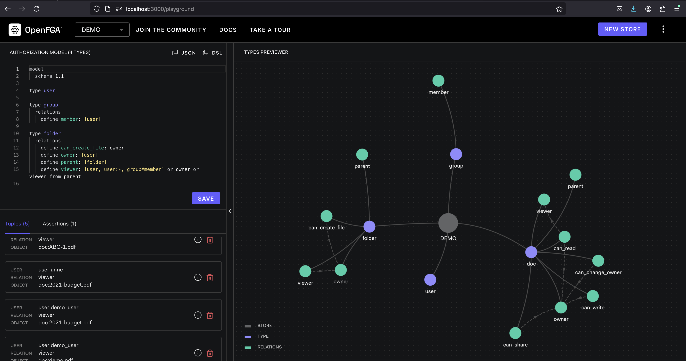

## mdb-openfga: OpenFGA + MongoDB



**MongoDB Atlas Vector Search** enables efficient similarity searches based on vector representations. This is particularly beneficial when working with unstructured data like text, images, or audio, where traditional keyword-based searches might fall short.

**Key Advantages:**

* **Semantic Understanding:** Vector representations capture the underlying meaning and context of data, allowing for more accurate and relevant search results.
* **Efficient Retrieval:** Vector search algorithms are highly optimized for finding similar items quickly, even in large datasets.
* **Scalability:** MongoDB Atlas Vector Search can handle massive datasets and scale seamlessly as your application grows.

**Integration with OpenFGA:**

When combined with OpenFGA, MongoDB Atlas Vector Search provides a powerful solution for secure document access. You can use vector search to retrieve relevant documents based on their content, and then apply OpenFGA's access control rules to ensure that only authorized users can view the results.

**Example:**

Imagine a document management system where users can search for documents based on their content. By using MongoDB Atlas Vector Search, you can efficiently retrieve documents that are semantically similar to the user's query. OpenFGA can then be used to enforce access control, ensuring that users only see documents they are authorized to view.

## OpenFGA: A Fine-Grained Access Control (FGAC) System

**OpenFGA** is an open-source, authorization platform designed to provide fine-grained access control for cloud-native applications. It offers a flexible and scalable solution for managing user permissions and access to resources.

### Key Features

* **Fine-grained Access Control:** Allows for granular control over resource access, granting or denying permissions based on specific conditions.
* **Policy-based Authorization:** Defines policies to govern access rules, making it easier to manage and enforce permissions.
* **Scalability:** Handles large-scale systems and can be integrated with various authorization models.
* **Extensibility:** Supports custom authorization models and can be integrated with other systems.
* **Open Source:** Available under the Apache License 2.0, providing flexibility and community support.

### How it Works

OpenFGA operates on the concept of **tuples**. A tuple represents a permission, consisting of a user, a relation (e.g., "read", "write"), and an object (e.g., a file, a database). Policies are defined to specify which tuples are allowed or denied. When a user tries to access a resource, OpenFGA evaluates the corresponding tuple against the defined policies to determine whether access is granted or denied.

### Prerequisites

* Docker installed: [https://docs.docker.com/desktop/install/mac-install/](https://docs.docker.com/desktop/install/mac-install/)
* Basic understanding of Docker, MongoDB and OpenFGA.

### Running OpenFGA

1. Pull the OpenFGA Docker image:

   ```bash
   docker pull openfga/openfga
   ```

2. Run the OpenFGA container with exposed ports:

   ```bash
   docker run -p 8080:8080 -p 3000:3000 openfga/openfga run
   ```

   - This command exposes ports 8080 and 3000 for OpenFGA web interface and API access, respectively.
   - Refer to the official OpenFGA documentation for further configuration ([https://github.com/openfga/openfga](https://github.com/openfga/openfga)).


### Setting Up Local Atlas Environment

1. Pull the MongoDB Atlas local Docker image:

   ```bash
   docker pull mongodb/mongodb-atlas-local
   ```

2. Run the MongoDB Atlas local container:

   ```bash
   docker run -p 27017:27017 mongodb/mongodb-atlas-local
   ```

   - This command exposes port 27017 on your machine for connecting to the database.

### Creating a Vector Search Index with mongosh

This section guides you through creating a vector search index for efficient similarity searches within OpenFGA data.

1. Connect to the local Atlas cluster using `mongosh`:

   ```bash
   mongosh "mongodb://localhost/demo?directConnection=true"
   ```

2. Switch to the `demo` database (replace with your actual database name if needed):

   ```
   use demo
   ```

3. Create a vector search index named "vector_index" on the "embeddings" field:

   ```javascript
   db.mdb_fga.createSearchIndex(
       "vector_index",
       "vectorSearch", // index type
       {
           fields: [
               {
                   "type": "vector",
                   "numDimensions": 1536,
                   "path": "embeddings",
                   "similarity": "cosine"
               },
           ]
       }
   );
   ```

**Installing Required Python Libraries**

```bash
pip install asyncio requests pymongo unstructured openai
```

This command installs all the necessary libraries (`asyncio`, `requests`, `pymongo`, `unstructured`, and `openai`) for running the Python code.

**Unstructured: Extracting Meaning from Documents**

Unstructured empowers you to break down text documents into smaller, more manageable units. Imagine a research paper: Unstructured can divide it into sections, paragraphs, or even sentences, making it easier to process and analyze. The library also helps extract entities like names, dates, and locations, aiding in information retrieval.

**OpenFGA: Securing Access to Extracted Data**

You define policies that govern user permissions based on specific conditions. When a user tries to access a document or its extracted data, OpenFGA evaluates the corresponding user and document against these policies, granting or denying access.

**MongoDB Atlas Vector Search: Finding Similar Documents Efficiently**

Imagine you're searching for a specific concept within a document collection. Keyword-based searches might miss relevant documents that don't contain the exact keywords. Vector search, however, analyzes the vector representations of document content, allowing you to find semantically similar documents, even if they use different wording.

**The Power of Combining these Tools**

By integrating these three tools, you create a robust and secure document management system. Here's the workflow:

1. **Unstructured processes documents:** Divides documents, extracts information, and generates embeddings (numerical representations) for each section.
2. **Azure OpenAI (integrated with Unstructured) creates embeddings:** Captures the semantic meaning of document sections.
3. **Data is stored in MongoDB:** Partitioned sections and their embeddings are stored for efficient retrieval.
4. **OpenFGA enforces access control:** Users can search based on vector representations, but only authorized users can view specific documents based on OpenFGA policies.

## Adding Permissions with `add_tuple` in OpenFGA

The `add_tuple` function you saw in the code snippet plays a crucial role in managing access control within the mdb-openfga application. It interacts with OpenFGA to grant a user permission to view a specific resource.

Here's a breakdown of how `add_tuple` works:

1. **Arguments:**
    - `USER`: This represents the user for whom you're granting permission. The code formats it as `"user:"+USER` for consistency within OpenFGA.
    - `RESOURCE`: This represents the resource the user is being granted access to. In the example, it's formatted as `"doc:"+RESOURCE` (assuming documents).

2. **API Call:**
    - The function constructs a POST request to the OpenFGA API endpoint (`/stores/{store_id}/write`). This endpoint is used for writing data (tuples) to the OpenFGA store.
    - The request includes an authorization header with a bearer token for authentication.
    - The request body contains a JSON object with the following structure:
        - `writes`: This key holds an object specifying the tuples to be added.
            - `tuple_keys`: This is an array containing the tuple objects defining the permissions. Each tuple object has three properties:
                - `user`: The user ID as formatted earlier.
                - `relation`: This defines the type of permission being granted. In this case, it's set to `"viewer"` to indicate read access.
                - `object`: The resource ID as formatted earlier.
        - `authorization_model_id`: This specifies the ID of the authorization model being used in OpenFGA. This model defines the access control rules that govern how tuples are evaluated.

3. **Response:**
    - The function sends the request and receives a response from the OpenFGA API. This response is a JSON object that indicates whether the write operation was successful or not.

**In essence, `add_tuple` creates a new tuple in OpenFGA, stating that a specific user (`USER`) has the permission to view a specific resource (`RESOURCE`). This tuple will then be used by OpenFGA's access control mechanisms to determine whether the user is authorized to access the resource during future requests.**

## Understanding `check_authorization` in mdb-openfga

The `check_authorization` function plays a vital role in the mdb-openfga application. It's responsible for determining whether a given user has permission to access a specific resource based on the access control policies defined in OpenFGA.

**How it Works:**

1. **Arguments:**
    - `tuple_key`: This is a JSON object that represents a tuple. A tuple, as you know, defines a permission. It typically contains three properties:
        - `user`: The user ID.
        - `relation`: The type of permission (e.g., "viewer", "editor").
        - `object`: The resource ID.

2. **API Call:**
    - The function sends a POST request to the OpenFGA API endpoint `/stores/{store_id}/check`. This endpoint is used to evaluate a tuple against the defined authorization model.
    - The request includes an authorization header with a bearer token for authentication.
    - The request body contains a JSON object with the following structure:
        - `authorization_model_id`: The ID of the authorization model being used.
        - `tuple_key`: The tuple object that you want to check.

3. **Response:**
    - The OpenFGA API returns a JSON response indicating whether the user is authorized to access the resource. The response typically contains a `bool` value:
        - `true`: The user has permission.
        - `false`: The user does not have permission.

**In essence, `check_authorization` takes a tuple as input and queries OpenFGA to determine if the user specified in the tuple is allowed to perform the action (relation) on the specified resource (object).**


**Running the demo**

```
python3 demo.py
```

#### Full Source Code
```python
import asyncio
import requests
import json
import pymongo
from unstructured.partition.auto import partition
from openai import AzureOpenAI

class FGA_MDB_DEMO:
    def __init__(self, azure_endpoint, api_version, api_key, mongo_uri, fga_api_url, fga_store_id, fga_api_token, authorization_model_id, db_name, collection_name):
        self.az_client = AzureOpenAI(azure_endpoint=azure_endpoint, api_version=api_version, api_key=api_key)
        self.mongo_client = pymongo.MongoClient(mongo_uri)
        self.fga_api_url = fga_api_url
        self.fga_store_id = fga_store_id
        self.fga_api_token = fga_api_token
        self.authorization_model_id = authorization_model_id
        self.db_name = db_name
        self.collection_name = collection_name

    def generate_embeddings(self, text, model=""): 
        return self.az_client.embeddings.create(input = [text], model=model).data[0].embedding

    def check_authorization(self, tuple_key):
        url = f"{self.fga_api_url}/stores/{self.fga_store_id}/check"
        headers = {
            "Authorization": f"Bearer {self.fga_api_token}",
            "content-type": "application/json",
        }
        data = {
            "authorization_model_id": self.authorization_model_id,
            "tuple_key": tuple_key
        }
        response = requests.post(url, headers=headers, data=json.dumps(data))
        return response.json()

    def add_tuple(self, USER, RESOURCE):
        url = f"{self.fga_api_url}/stores/{self.fga_store_id}/write"
        headers = {
            "Authorization": f"Bearer {self.fga_api_token}",
            "content-type": "application/json",
        }
        data = {
            "writes": {
                "tuple_keys": [
                {
                    "user": "user:"+USER,
                    "relation": "viewer",
                    "object": "doc:"+RESOURCE
                }
                ]
            },
            "authorization_model_id": self.authorization_model_id
        }
        response = requests.post(url, headers=headers, data=json.dumps(data))
        return response.json()

    def search_tool(self, text, USER_ID):
        response = self.mongo_client[self.db_name][self.collection_name].aggregate([
        {
            "$vectorSearch": {
                "index": "vector_index",
                "queryVector": self.az_client.embeddings.create(model="text-embedding-ada-002",input=text).data[0].embedding,
                "path": "embeddings",
                "limit": 5,
                "numCandidates": 30
            }
        }, {"$project":{"_id":0, "embeddings":0, "metadata":0}}
        ])
        for doc in response:
            tuple_key = {"user":"user:"+USER_ID,"relation":"viewer","object":"doc:"+doc["source"]}
            response = self.check_authorization(tuple_key)
            if response['allowed']:
                print(f"Access Granted: User '{USER_ID}' has permission to read document '{doc['source']}'.")
            else:
                print(f"Access Denied: User '{USER_ID}' does not have permission to read document '{doc['source']}'.")

    def partition_pdf(self, resource):
        mdb_db = self.mongo_client[self.db_name]
        mdb_collection = mdb_db[self.collection_name]
        print("Clearing the db first...")
        mdb_collection.delete_many({})
        print("Database cleared.")
        print("Starting PDF document partitioning...")
        elements = partition(resource)
        for element in elements:
            mdb_collection.insert_one({
                "text":str(element.text),
                "embeddings":self.generate_embeddings(str(element.text), "text-embedding-ada-002"),
                "metadata": {
                    "raw_element":element.to_dict(),
                },
                "source":resource
            })
        print("PDF partitioning and database insertion completed successfully.")

    def fga_setup(self, user, resource):
        response = self.add_tuple(user, resource)
        print(f"FGA setup response: {response}")
    
    async def main(self, user, resource):
        print("Starting FGA setup...")
        self.fga_setup(user, resource)
        self.partition_pdf(resource)
        print("Waiting for index to be updated. This may take a few seconds...")
        await asyncio.sleep(15)
        print("Starting search tool...")
        self.search_tool("test",user)
        self.search_tool("test",user+"-denyme")
        print("Process completed successfully.")

if __name__ == "__main__":
    fga_mdb_demo = FGA_MDB_DEMO(
        azure_endpoint="",
        api_version="2024-04-01-preview",
        api_key="",
        mongo_uri="mongodb://localhost:27017/demo?directConnection=true",
        fga_api_url='http://localhost:8080',
        fga_store_id='01J8VP1HYCHN459VT76DQG0W2R',
        fga_api_token='',
        authorization_model_id='01J8VP3BMPZNFJ480G5ZNF3H0C',
        db_name="demo",
        collection_name="mdb_fga"
    )
    asyncio.run(fga_mdb_demo.main("demo_user", "demo.pdf"))
```